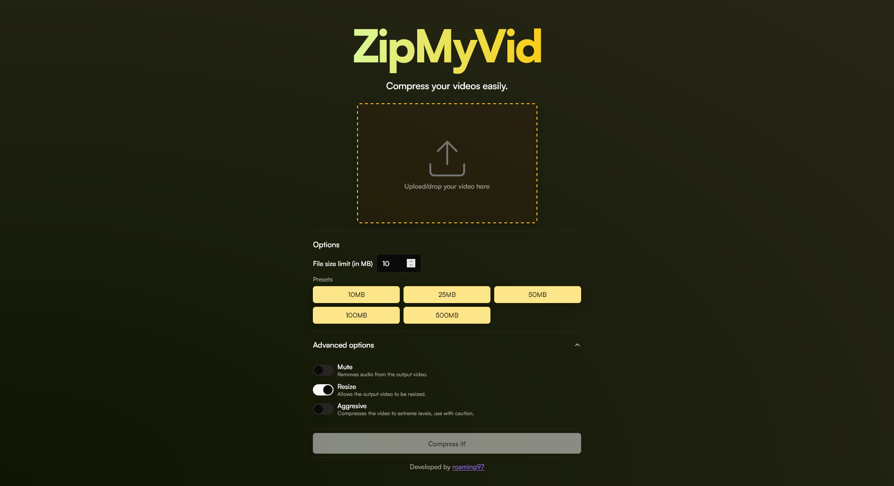

# ZipMyVid

Compress your videos easily.

This project still has some limitations due to the usage that FFmpeg asks for the web in order to run properly (and on a single thread), there's ongoing work to better handle this.

# What is this?

**ZipMyVid** is a video compression web tool to ease the process of sending videos through channels with file size limitations, inspired by [8mb.video](https://8mb.video).

